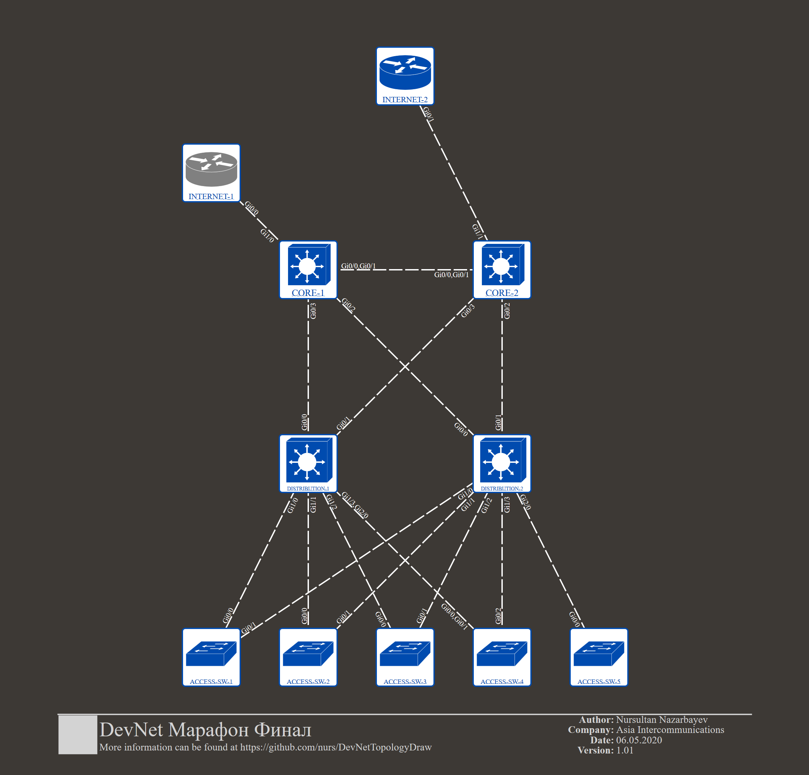

# DevNetTopologyDraw

Вариант реализации задания на визуализацию сетевых топологий для Cisco DevNet Марафона.

### Используемый стек:
  - Python3
  - [Nornir](https://nornir.readthedocs.io/en/latest/)
  - [NAPALM](https://napalm.readthedocs.io/en/latest/)
  - [NeXt UI](https://developer.cisco.com/site/neXt/) (JS+HTML5)

### Установка и первичная настройка:
Установите зависимости:
```sh
$ mkdir ~/devnet_marathon_endgame
$ cd ~/devnet_marathon_endgame
$ git clone https://github.com/iDebugAll/devnet_marathon_endgame.git
$ cd devnet_marathon_endgame
$ pip3 install -i requirements.txt
```
Отредактируйте конфигурационные файлы Nornir для доступа на целевую сетевую инфраструктуру.
По умолчанию используется модуль SimpleInventory.
В файле nornir_config.yml необходимо указать используемые файлы хостов и групп.
Файл хостов, используемый по умолчанию, настроен на работу по SSH с сетевой топологией из [Cisco Modeling Labs](https://devnetsandbox.cisco.com/RM/Diagram/Index/685f774a-a5d6-4df5-a324-3774217d0e6b?diagramType=Topology) в Cisco Devnet Sandbox.
Для подключения к Cisco DevNet Sandbox требуется бесплатная регистрация, резервирование и VPN-доступ.

### Использование:
Для синхронизации топологии необходимо запустить скрипт generate_topology.py.
После того, как скрипт завершит работу, необходимо открыть файл main.html.
```
$ python3.7 generate_topology.py 
Изменений в топологии не обнаружено.
Для просмотра топологии откройте файл main.html
```


